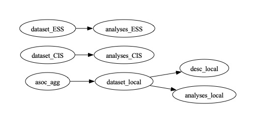

**Replication files** for [Laia Balcells](https://www.laiabalcells.com/) and [Francisco Villamil](https://franvillamil.github.io/), "Generational Legacies of Authoritarianism: Evidence from Spain", forthcoming at *European Journal of Political Research*.

> **Abstract:** What are the long-term legacies of authoritarian repression on civil society? While much research has focused on high-intensity repression, we examine the more pervasive, low-intensity repression characteristic of many authoritarian regimes. We argue that repression's effects vary by generation, reducing civic engagement among those who came of age during the authoritarian period but not among younger generations who either only lived their childhood under the regime or were children and grew up under democracy. Using data from 140,000 individual surveys conducted between 1989 and 2017, we find that cohorts who reached adulthood during the Franco regime consistently exhibit lower civic engagement than those who came of age in democratic Spain. We show evidence consistent with the main results from complementary analyses using local-level data on repression. These findings contribute to the literature on authoritarian legacies, emphasizing the generational and contextual variability of their effects on civil society.

### INSTRUCTIONS

This folder includes all the necessary materials to replicate the results from both the main article and the Online Appendix. They were last tested on R 4.3.2 on macOS 15.7. The code is organized in tasks, located in each folder, that depend on the results of the previous ones.

There are three independent groups of analyses: the main analyses using the CIS survey data, the complementary analyses using ESS data, and the local-level analyses. We detail below the order in which to run each `.R` file and which ones correspond to each of the figures in the article/Online Appendix.



Two additional folders (`input` and `func`) include original datafiles and `R` functions necessary to run the code.

#### Main survey analyses

1. `dataset_CIS`
2. `analyses_CIS` (Figures 1 to 3, Figures A1 to A6, Table A2 to A6)

#### Complementary survey analyses (ESS)

1. `dataset_ESS`
2. `analyses_ESS` (Figures A7 and A8)

#### Local-level analyses

1. `asoc_agg`
2. `dataset_local`
3. `analyses_local` (Figure A11, Tables A8 and A9)
4. `desc_local` (Figures A9 and A10)

#### Using `make`

Alternatively, the repository can be downloaded and run using `make` in macOS/Unix:

```
git clone https://github.com/franvillamil/gen_legacies
cd gen_legacies
make clean
make
```